# Diagrama de Arquitectura de la Red Convolucional (Mermaid)

Este documento contiene la representación de la red neuronal **`EyePupilCNN`** de PyTorch en código Mermaid. Puedes visualizarlo en editores de Markdown compatibles o en herramientas online como [Mermaid Live Editor](https://mermaid.live/).

```mermaid
graph TD
    Input["Entrada: Imagen ROI (1x64x64)"] --> Conv1["Conv2d (1 -> 16 filtros, 3x3, pad 1)"]
    Conv1 --> BN1["BatchNorm2d (16 canales)"]
    BN1 --> ReLU1["ReLU Activation"]
    ReLU1 --> MaxPool1["MaxPool2d (2x2, stride 2)"]
    
    MaxPool1 -->|Shape: 16x32x32| Conv2["Conv2d (16 -> 32 filtros, 3x3, pad 1)"]
    Conv2 --> BN2["BatchNorm2d (32 canales)"]
    BN2 --> ReLU2["ReLU Activation"]
    ReLU2 --> MaxPool2["MaxPool2d (2x2, stride 2)"]
    
    MaxPool2 -->|Shape: 32x16x16| Conv3["Conv2d (32 -> 64 filtros, 3x3, pad 1)"]
    Conv3 --> BN3["BatchNorm2d (64 canales)"]
    BN3 --> ReLU3["ReLU Activation"]
    ReLU3 --> MaxPool3["MaxPool2d (2x2, stride 2)"]
    
    MaxPool3 -->|Shape: 64x8x8| Flat["Flatten Layer (4096 unidades)"]
    Flat --> FC1["Linear Layer (4096 -> 128)"]
    FC1 --> ReLU_FC["ReLU Activation"]
    ReLU_FC --> Drop["Dropout Layer (tasa 0.3)"]
    Drop --> FC2["Linear Layer (128 -> 2)"]
    FC2 --> Tanh["Tanh Activation"]
    Tanh --> Output["Salida: Vector de Coordenadas Oculares (nx, ny)"]

    %% Estilos estéticos académicos
    style Input fill:#e1f5fe,stroke:#0288d1,stroke-width:2px
    style Output fill:#e8f5e9,stroke:#388e3c,stroke-width:2px
    style Conv1 fill:#eceff1,stroke:#607d8b,stroke-width:1px
    style Conv2 fill:#eceff1,stroke:#607d8b,stroke-width:1px
    style Conv3 fill:#eceff1,stroke:#607d8b,stroke-width:1px
    style BN1 fill:#fff9c4,stroke:#fbc02d,stroke-width:1px
    style BN2 fill:#fff9c4,stroke:#fbc02d,stroke-width:1px
    style BN3 fill:#fff9c4,stroke:#fbc02d,stroke-width:1px
    style MaxPool1 fill:#ffe0b2,stroke:#f57c00,stroke-width:1px
    style MaxPool2 fill:#ffe0b2,stroke:#f57c00,stroke-width:1px
    style MaxPool3 fill:#ffe0b2,stroke:#f57c00,stroke-width:1px
    style Flat fill:#f3e5f5,stroke:#7b1fa2,stroke-width:1px
    style FC1 fill:#e8eaf6,stroke:#3f51b5,stroke-width:1px
    style FC2 fill:#e8eaf6,stroke:#3f51b5,stroke-width:1px
    style Tanh fill:#ffebee,stroke:#c62828,stroke-width:2px
```

