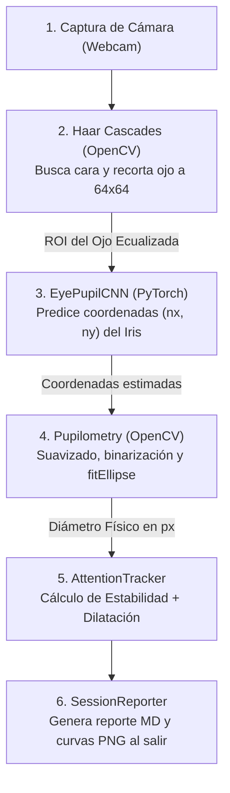

# 👁️ Guía Completa y Sencilla de EyeStim: ¿Cómo funciona mi proyecto?

Esta guía está diseñada para explicarte de forma súper descriptiva y detallada, pero en un lenguaje muy amigable, absolutamente todo el funcionamiento del proyecto **EyeStim**. El objetivo es que comprendas cada script de código, cada fórmula matemática y cada concepto de inteligencia artificial de manera intuitiva y clara.

---

## 💡 ¿Qué es EyeStim y para qué sirve?

**EyeStim** es un sistema inteligente de **análisis de atención visual y pupilometría**. Su función principal es observar la mirada del usuario en tiempo real a través de una cámara web convencional y responder a dos preguntas críticas:
1. **¿A qué parte de la pantalla estás mirando?** (Mapeo espacial en 5 zonas discretas: Centro, Arriba, Abajo, Izquierda o Derecha).
2. **¿Qué tanto esfuerzo mental o atención estás prestando?** (Un porcentaje continuo de 0% a 100%).

Al presionar la tecla `q` para cerrar el programa interactivo (`src/show_eyes.py`), el sistema recopila toda la información registrada y exporta automáticamente un **reporte de sesión** en la carpeta `docs/` que incluye:
- Una tabla de permanencia temporal por zona (cuántos segundos y qué porcentaje de tiempo estuviste mirando a cada cuadrante).
- Dos gráficos que trazan la evolución de tu diámetro pupilar y tu score de atención a lo largo del tiempo en segundos.

---

## 🛠️ El Pipeline Híbrido: ¿Cómo funciona paso a paso?

El procesamiento se realiza cuadro por cuadro (en tiempo real) y se divide en **cuatro componentes independientes y especializados** que interactúan entre sí de manera secuencial:

### Paso 1: Localización del Ojo (Detección Clásica)
- **¿Qué hace?**: El script `src/show_eyes.py` captura el video de la cámara web. Utiliza clasificadores **Haar Cascades** de OpenCV para buscar el rostro del usuario y delimitar la zona ocular.
- **¿Cómo funciona?**: Recorta un cuadradito exacto de **$64 \times 64$ píxeles** centrado en el ojo detectado. A esta imagen pequeña se le conoce técnicamente como **ROI del Ojo** (Región de Interés).
- **Tratamiento de luz (CLAHE)**: Antes de pasar la imagen a la inteligencia artificial, se le aplica un filtro que empareja las luces y las sombras de forma adaptativa. Esto evita que los reflejos del cuarto confundan los cálculos.

### Paso 2: Localización del Iris por Inteligencia Artificial (CNN)
- **¿Qué hace?**: La ROI del ojo ecualizada ingresa a la red neuronal profunda **`EyePupilCNN`** (definida en `src/model.py`).
- **¿Cómo funciona?**: La red analiza los patrones de píxeles y genera **dos números decimales** entre `-1.0` y `1.0`, los cuales representan las coordenadas normalizadas de la pupila $(n_x, n_y)$ con respecto al centro del recorte ocular.
  - `-1.0` significa extremo izquierdo o superior del ojo.
  - `1.0` significa extremo derecho o inferior del ojo.
  - `0.0` significa que miras justo al centro.

### Paso 3: Aislamiento y Medición de la Pupila (OpenCV local)
Una vez que la inteligencia artificial estima dónde está la pupila, el script `src/pupilometry.py` realiza un procesamiento digital clásico enfocado en esa coordenada para medir su tamaño exacto en píxeles:
1. **Sub-recorte de $32 \times 32$ píxeles**: Se recorta un cuadradito muy cerrado en torno a la coordenada predicha por la CNN para eliminar pestañas lejanas o cejas.
2. **Suavizado Gaussiano**: Se aplica un filtro difuminador (`cv2.GaussianBlur`) que suaviza los píxeles individuales de las pestañas o reflejos pequeños para que no afecten los bordes.
3. **Búsqueda del píxel más negro**: Dado que la pupila es el punto más oscuro de la cuenca ocular, el algoritmo busca el píxel con menor intensidad lumínica ($Min_{gris}$).
4. **Binarización Adaptativa**: Todo píxel con color menor o igual a $Min_{gris} + 15$ se pinta de **negro puro**, y todo el resto se vuelve **blanco puro**. De este modo, la pupila se convierte en un círculo negro perfecto y aislado.
5. **Cierre Morfológico**: Si el usuario tiene un brillo de luz en medio de la pupila, esta operación rellena los huecos internos de color negro para consolidar el círculo de la pupila.
6. **Ajuste Elíptico (`cv2.fitEllipse`)**: Se extraen los contornos negros del círculo de la pupila y se calcula el óvalo matemático (elipse) que mejor los cubra. El diámetro de la pupila se obtiene calculando el promedio del eje mayor y menor de dicha elipse.

### Paso 4: Estimación del Score de Atención y Dirección
El módulo `src/attention.py` recibe las coordenadas de la mirada $(n_x, n_y)$ y el diámetro de la pupila para realizar dos cálculos dinámicos:
- **Mapeo de Zonas (Hacia dónde miras)**:
  - Si la distancia de la mirada al centro es menor a `0.35` (umbral del centro), se clasifica como **Centro**.
  - Si es mayor, se divide la pantalla en 4 cuadrantes diagonales de $90^\circ$ calculando la pendiente de las coordenadas para determinar si miras **Arriba**, **Abajo**, **Izquierda** o **Derecha**.
- **Score de Atención (Concentración)**:
  - **Estabilidad de Mirada ($E_{gaze}$)**: El sistema almacena una ventana móvil de las últimas 30 posiciones de tu mirada. Si los ojos están quietos en un punto, la desviación estándar es muy baja (menor a `0.25`), por lo que tu estabilidad espacial de atención se considera del 100%. Si tus ojos saltan erráticamente, tu estabilidad disminuye de forma lineal hacia 0%.
  - **Dilatación Cognitiva ($F_{pupil}$)**: El sistema promedia el diámetro de tu pupila durante los primeros 100 fotogramas (3 segundos de calibración) para guardar tu **Línea Base** relajada ($D_{base}$). Si después tu pupila se dilata de forma sostenida entre un 2% y 20% respecto a esa línea base (indicio involuntario de esfuerzo cognitivo), se te aplica un **bono multiplicador de 1.15** en tu score de atención. Si tu pupila cambia bruscamente por parpadeos o luz, se penaliza con un factor de `0.80` para evitar lecturas ruidosas.
  - **Score Final**: Se calcula multiplicando la estabilidad espacial por la fluctuación pupilar y se restringe en el rango de `[0.0, 100.0]`.

---

## 🔬 La Estructura de la Inteligencia Artificial (EyePupilCNN)

El archivo [src/model.py](file:///c:/Users/Eduar/AREA_PROGRAMCION/01_PROYECTOS/Eyestim/src/model.py) define la arquitectura de la red neuronal convolucional personalizada en PyTorch. Consta de las siguientes capas ordenadas de forma secuencial:

1. **Entrada**: Recibe una imagen en escala de grises de $1 \times 64 \times 64$ píxeles.
2. **Bloque Convolucional 1**:
   - **`Conv2d` (Filtros: 1 -> 16, Tamaño de Kernel: 3x3)**: Aplica 16 filtros distintos sobre la imagen para extraer mapas de bordes del iris y del párpado.
   - **`BatchNorm2d` (16 canales)**: Normaliza los datos intermedios de la capa para acelerar el entrenamiento y evitar que los valores se descontrolen.
   - **`ReLU`**: Función de activación que convierte todos los números negativos en cero y deja pasar los positivos intactos.
   - **`MaxPool2d` (2x2)**: Reduce el tamaño de la imagen a la mitad ($16 \times 32 \times 32$). Conserva únicamente el píxel de mayor valor de cada cuadrante de 2x2.
3. **Bloque Convolucional 2**:
   - **`Conv2d` (Filtros: 16 -> 32, Kernel: 3x3)**: Extrae características más complejas de las texturas internas del iris.
   - **`BatchNorm2d` (32 canales)** -> **`ReLU`** -> **`MaxPool2d` (2x2)**: Reduce el tamaño de salida a $32 \times 16 \times 16$.
4. **Bloque Convolucional 3**:
   - **`Conv2d` (Filtros: 32 -> 64, Kernel: 3x3)**: Extrae patrones geométricos de alto nivel del centro de la pupila.
   - **`BatchNorm2d` (64 canales)** -> **`ReLU`** -> **`MaxPool2d` (2x2)**: Reduce el tamaño final a $64 \times 8 \times 8$.
5. **Aplanado (`Flatten`)**:
   - Convierte la matriz tridimensional final ($64 \times 8 \times 8$) en una sola fila larga de **4096 números** listos para ser conectados a las neuronas lógicas.
6. **Bloque de Clasificación / Regresión**:
   - **`Linear` (4096 -> 128 neuronas)**: Primera capa densa que combina los 4096 patrones visuales en 128 conceptos abstractos de posición.
   - **`ReLU`**: Activación lógica.
   - **`Dropout` (Tasa: 0.3)**: Apaga al azar el 30% de las neuronas en cada paso de entrenamiento. Esto evita el "macheteo" (sobreajuste), forzando a que la red no dependa de neuronas específicas y aprenda de forma generalizada.
   - **`Linear` (128 -> 2 neuronas)**: Capa de salida que proyecta los 128 conceptos abstractos en dos coordenadas finales continuas: $(n_x, n_y)$.
   - **`Tanh` (Tangente Hiperbólica)**: Función matemática que comprime los dos números resultantes al rango estricto de **$[-1, 1]$**, asegurando que la pupila predicha jamás se dibuje fuera de los límites geométricos reales del recorte ocular.

---

## 🎛️ Descripción Detallada de los Scripts de Código

A continuación se detalla la función exacta de cada archivo en la carpeta `src/`:

*   [config.py](file:///c:/Users/Eduar/AREA_PROGRAMCION/01_PROYECTOS/Eyestim/src/config.py): 
    *   *¿Qué hace?*: Centraliza todas las constantes del proyecto. Aquí se definen el tamaño de las ventanas de procesamiento ($64 \times 64$ y $32 \times 32$), el tamaño de lote de entrenamiento (`BATCH_SIZE = 32`), las épocas (`EPOCHS = 15`), y los umbrales de varianza espacial y temporal de la atención.
*   [utils.py](file:///c:/Users/Eduar/AREA_PROGRAMCION/01_PROYECTOS/Eyestim/src/utils.py):
    *   *¿Qué hace?*: Contiene rutinas auxiliares de OpenCV. Realiza un sanity check al inicio para validar si el compilador local de OpenCV soporta adecuadamente la función matemática de ajuste elíptico `cv2.fitEllipse`.
*   [dataset.py](file:///c:/Users/Eduar/AREA_PROGRAMCION/01_PROYECTOS/Eyestim/src/dataset.py):
    *   *¿Qué hace?*: Descarga programáticamente el dataset BioID desde los servidores oficiales, descomprime las imágenes PGM y sus coordenadas oculares, y define la clase de PyTorch `EyeStimDataset` para ecualizar con CLAHE y alimentar las muestras con jittering al bucle de entrenamiento.
*   [model.py](file:///c:/Users/Eduar/AREA_PROGRAMCION/01_PROYECTOS/Eyestim/src/model.py):
    *   *¿Qué hace?*: Define la estructura secuencial de la red convolucional `EyePupilCNN` en PyTorch detallada en la sección anterior.
*   [train.py](file:///c:/Users/Eduar/AREA_PROGRAMCION/01_PROYECTOS/Eyestim/src/train.py):
    *   *¿Qué hace?*: Script ejecutable para entrenar la red desde cero. Descarga el dataset, realiza la partición 80/20 de entrenamiento/validación, ejecuta el optimizador Adam para ajustar los pesos del modelo a lo largo de 15 épocas y guarda el archivo resultante en `models/mi_modelo_detectar_ojos.pth`.
*   [predict.py](file:///c:/Users/Eduar/AREA_PROGRAMCION/01_PROYECTOS/Eyestim/src/predict.py):
    *   *¿Qué hace?*: Realiza inferencias en modo de testeo sobre imágenes de BioID individuales para graficar y comparar visualmente el centro anotado por expertos (punto verde) contra la predicción matemática de la CNN (punto rojo), reportando el error en píxeles.
*   [pupilometry.py](file:///c:/Users/Eduar/AREA_PROGRAMCION/01_PROYECTOS/Eyestim/src/pupilometry.py):
    *   *¿Qué hace?*: Contiene la clase `PupilEstimator`. Ejecuta el pipeline clásico de filtrado Gaussiano, binarización adaptativa local respecto al color más negro, cierre morfológico y ajuste de elipse de OpenCV. Incluye pruebas unitarias con círculos artificiales.
*   [attention.py](file:///c:/Users/Eduar/AREA_PROGRAMCION/01_PROYECTOS/Eyestim/src/attention.py):
    *   *¿Qué hace?*: Contiene la clase `AttentionTracker`. Administra el historial de mirada, realiza la calibración dinámica del promedio de pupila inicial, clasifica la dirección visual de enfoque a cuadrantes y calcula el score final de atención (0%-100%). Incluye pruebas unitarias integradas de comportamiento estático y dinámico.
*   [reporter.py](file:///c:/Users/Eduar/AREA_PROGRAMCION/01_PROYECTOS/Eyestim/src/reporter.py):
    *   *¿Qué hace?*: Contiene la clase `SessionReporter`. Registra en memoria las series de tiempo del diámetro, la atención y los cuadrantes durante la sesión interactiva. Al salir, procesa las estadísticas agregadas, plotea y guarda las curvas de evolución con Matplotlib en `docs/attention_evolution.png` y escribe el reporte estructurado en `docs/session_report.md`.
*   [show_eyes.py](file:///c:/Users/Eduar/AREA_PROGRAMCION/01_PROYECTOS/Eyestim/src/show_eyes.py):
    *   *¿Qué hace?*: **El script interactivo principal**. Enciende la cámara web local, ejecuta la detección facial de Haar Cascades y acopla los estimadores de la CNN, pupilometría clásica y atención en tiempo real. Dibuja el visor interactivo (contornos verdes en pupilas, flechas amarillas de mirada y la barra de progreso superior de colores que reacciona a tu atención cognitiva). Al presionar la tecla `q` cierra la cámara y exporta de forma automática los reportes de sesión del reportero.

---

## 📚 Glosario Breve de Términos

*   **ROI (Región de Interés)**: El cuadradito o sub-sección recortada de la imagen que nos interesa analizar (el ojo de $64\times64$ y la pupila de $32\times32$), ignorando el resto del fotograma ruidoso de la cámara web.
*   **Haar Cascades**: Plantilla geométrica rápida de OpenCV que localiza caras y ojos en milisegundos analizando contrastes de luz y sombra en la imagen facial.
*   **Inteligencia Artificial Convolucional (CNN)**: Un modelo de redes profundas que aplica múltiples filtros (como matrices que detectan líneas verticales, horizontales u oblicuas) sobre la imagen del ojo para aprender a extraer formas de manera automática y jerárquica.
*   **Regresión Cartesiana**: Método de aprendizaje donde el modelo no clasifica categorías (como "gato" o "perro"), sino que estima valores numéricos continuos. En este proyecto se estiman dos coordenadas $(X, Y)$ decimales que marcan el centro de la pupila.
*   **Jittering (Ruido Geométrico)**: Aumentación de datos en entrenamiento donde se desplaza el ojo de forma aleatoria de su centro real para que la CNN no se acostumbre a predicciones estáticas perfectas y aprenda a tolerar los temblores naturales de la cabeza o de la cámara web del usuario.
*   **Binarización Adaptativa**: Operación matemática de píxeles que convierte una escala de grises en blanco y negro puros, recalculando el umbral de corte de manera dinámica píxel por píxel en base a los valores vecinos más cercanos.
*   **Ajuste Elíptico (fitEllipse)**: Algoritmo de mínimos cuadrados que aproxima matemáticamente el mejor óvalo (elipse) capaz de pasar y cubrir un conjunto de contornos binarizados oscuros, entregando su inclinación, centro y tamaño de ejes.
*   **Línea Base (Baseline)**: El diámetro fisiológico promedio de la pupila del sujeto calibrado en un estado de reposo inicial durante 3 segundos, sirviendo como punto de referencia para medir dilataciones cognitivas posteriores.
