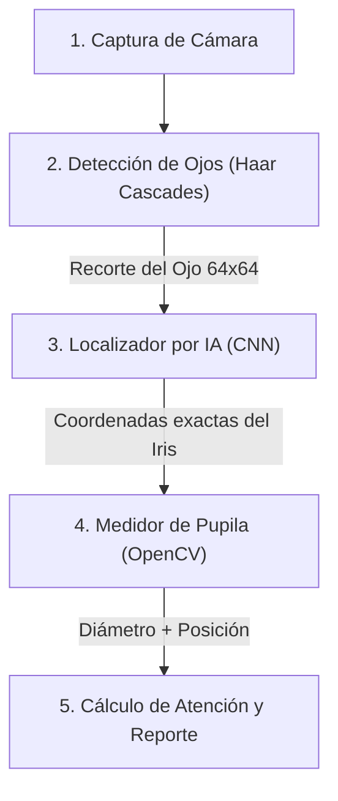

# 👁️ Guía Sencilla de EyeStim: ¿Cómo funciona mi proyecto?

Esta guía está diseñada para explicarte todo el proyecto **EyeStim** de forma súper fácil, sin tecnicismos complicados, y con definiciones sencillas de cada concepto para que entiendas perfectamente cómo funciona de inicio a fin.

---

## 💡 ¿Qué es EyeStim y para qué sirve?

Imagina que **EyeStim** es un **detective virtual** que te observa a través de tu cámara web. Su trabajo es responder a dos preguntas principales en tiempo real:
1. **¿Hacia dónde estás mirando en la pantalla?** (Centro, Arriba, Abajo, Izquierda o Derecha).
2. **¿Qué tan concentrado o atento estás?** (Expresado en un porcentaje de 0% a 100%).

Al final de cada sesión, cuando presionas la tecla `q` para salir, el detective escribe automáticamente un reporte con estadísticas de tu atención y gráficos de cómo varió el tamaño de tu pupila en el tiempo.

---

## 🛠️ La "Fórmula Secreta": ¿Cómo funciona paso a paso?

El programa procesa las imágenes de tu cámara web dividiendo el trabajo en **4 pasos sencillos**:

### Paso 1: Encontrar tu cara y tus ojos (Detección)
La cámara captura un fotograma. El programa usa una plantilla matemática rápida para encontrar dónde está tu rostro y recortar un cuadradito pequeño de $64 \times 64$ píxeles que contiene únicamente tu ojo.

### Paso 2: Adivinar el centro del ojo (Inteligencia Artificial)
Ese cuadradito de tu ojo entra a una **Red Neuronal Convolucional (CNN)**. Esta inteligencia artificial analiza la imagen y calcula las coordenadas exactas $(X, Y)$ del centro de tu iris. 

### Paso 3: Limpiar el ojo y medir la pupila (Procesamiento Clásico)
Usando la coordenada que adivinó la IA, el programa recorta un cuadradito aún más pequeño ($32 \times 32$ píxeles) centrado en tu pupila. Para medirla de forma exacta:
- Quita sombras y pestañas usando filtros de suavizado.
- Pinta la pupila de **negro puro** y el resto de **blanco puro**.
- Dibuja un óvalo (elipse) sobre el contorno negro y mide cuántos píxeles de diámetro tiene.

### Paso 4: Calcular tu nivel de atención
Finalmente, el sistema analiza dos cosas para saber tu concentración:
- **Estabilidad de mirada**: Si tus ojos se quedan fijos en un cuadrante de la pantalla, tu atención sube. Si tus ojos saltan de un lado a otro como locos, tu atención baja.
- **Dilatación pupilar**: El cerebro, al esforzarse mentalmente, dilata la pupila de forma involuntaria entre un 2% y 20%. El sistema detecta esta dilatación cognitiva y te premia con un extra de atención.

---

## 📚 Glosario de Palabras Complicadas

Aquí tienes la traducción a "español simple" de todos los términos técnicos del proyecto:

*   **ROI (Region of Interest / Región de Interés)**: 
    *   *Definición fácil*: Es simplemente un recorte de la imagen original. En lugar de procesar toda la foto de tu habitación, el programa recorta solo el cuadradito del ojo que le interesa analizar.
*   **Haar Cascades**: 
    *   *Definición fácil*: Un detector clásico y muy veloz que busca formas en la imagen (por ejemplo, sabe que los ojos suelen ser zonas más oscuras que la frente). Funciona como un molde o plantilla predefinida para encontrar caras y ojos al instante.
*   **CNN (Convolutional Neural Network / Red Neuronal Convolucional)**: 
    *   *Definición fácil*: Un cerebro artificial entrenado en computadora. La palabra **Convolucional** significa que la red aplica filtros especiales (parecidos a los de Instagram) para resaltar bordes, brillos e inclinaciones del ojo antes de tomar una decisión.
*   **Regresión**: 
    *   *Definición fácil*: En inteligencia artificial, clasificar es decir "esto es un ojo o no". **Regresión** es calcular números continuos. En tu proyecto, la red hace regresión porque calcula las coordenadas numéricas decimales exactas de dónde está el centro del ojo.
*   **Jittering (Temblor inducido)**: 
    *   *Definición fácil*: Es un truco de entrenamiento. Consiste en mover el recorte del ojo unos píxeles a la izquierda o derecha a propósito. Así, la IA aprende a localizar la pupila correctamente aunque la cámara o tu cabeza tiemblen un poco.
*   **CLAHE (Ecualización Adaptativa)**: 
    *   *Definición fácil*: Un filtro inteligente de contraste. Si tienes media cara en la sombra o la luz de tu cuarto es muy fuerte, CLAHE empareja la iluminación del ojo para que el iris y la pupila se distingan perfectamente.
*   **Binarización Adaptativa Local**: 
    *   *Definición fácil*: Convertir la imagen a blanco y negro puro. "Adaptativa local" significa que decide qué es negro y qué es blanco analizando los píxeles vecinos. Esto permite separar la pupila (oscura) del resto del ojo de forma muy limpia.
*   **cv2.fitEllipse**: 
    *   *Definición fácil*: Una función de OpenCV que ajusta un óvalo matemático sobre un grupo de puntos negros. Sirve para dibujar la elipse que mejor se adapta a la forma de tu pupila y así medir su diámetro promedio.
*   **Línea Base (Baseline)**: 
    *   *Definición fácil*: Es el tamaño de tu pupila en estado "normal y relajado". Se calcula promediando el tamaño de tu pupila durante los primeros 3 segundos de la sesión para tener un punto de comparación.
*   **Gaze Tracking (Seguimiento de Mirada)**: 
    *   *Definición fácil*: Mapear o calcular hacia qué dirección de la pantalla física estás apuntando la vista en base a la desviación del iris respecto a tu cuenca ocular.

---

## 🎛️ Explicación de los Archivos del Proyecto

Para saber qué hace cada script en el código de forma rápida:

*   [config.py](file:///c:/Users/Eduar/AREA_PROGRAMCION/01_PROYECTOS/Eyestim/src/config.py): Contiene todos los ajustes (el tamaño de los recortes, la velocidad de la cámara, los umbrales de atención, etc.).
*   [utils.py](file:///c:/Users/Eduar/AREA_PROGRAMCION/01_PROYECTOS/Eyestim/src/utils.py): Un archivo de herramientas que ayuda a verificar si la cámara funciona y si los módulos matemáticos de OpenCV están listos.
*   [dataset.py](file:///c:/Users/Eduar/AREA_PROGRAMCION/01_PROYECTOS/Eyestim/src/dataset.py): El cargador que descarga el dataset BioID de internet, lo descomprime y prepara las fotos de ojos para entrenar a la IA.
*   [model.py](file:///c:/Users/Eduar/AREA_PROGRAMCION/01_PROYECTOS/Eyestim/src/model.py): Aquí está diseñada la estructura física de la inteligencia artificial `EyePupilCNN` (las capas de filtros convolucionales y neuronas).
*   [train.py](file:///c:/Users/Eduar/AREA_PROGRAMCION/01_PROYECTOS/Eyestim/src/train.py): El script que entrena a la IA para que aprenda a base de repetir y corregir sus propios errores.
*   [predict.py](file:///c:/Users/Eduar/AREA_PROGRAMCION/01_PROYECTOS/Eyestim/src/predict.py): Sirve para hacer pruebas con imágenes estáticas y pintar un punto rojo donde la IA cree que está el ojo y uno verde donde realmente está.
*   [pupilometry.py](file:///c:/Users/Eduar/AREA_PROGRAMCION/01_PROYECTOS/Eyestim/src/pupilometry.py): Contiene el algoritmo clásico para limpiar el ojo, binarizarlo y medir el diámetro en píxeles.
*   [attention.py](file:///c:/Users/Eduar/AREA_PROGRAMCION/01_PROYECTOS/Eyestim/src/attention.py): Calcula el score de atención (0-100%) y detecta en cuál de los 5 cuadrantes estás mirando.
*   [reporter.py](file:///c:/Users/Eduar/AREA_PROGRAMCION/01_PROYECTOS/Eyestim/src/reporter.py): Escribe el archivo final Markdown y dibuja la gráfica PNG con las curvas de atención.
*   [show_eyes.py](file:///c:/Users/Eduar/AREA_PROGRAMCION/01_PROYECTOS/Eyestim/src/show_eyes.py): **El programa principal**. Abre la ventana de tu cámara, dibuja el HUD interactivo, la barra de atención dinámica de colores y te permite interactuar con el sistema en tiempo real.
