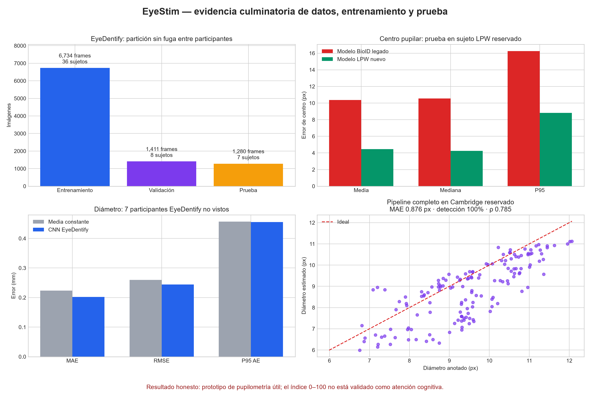
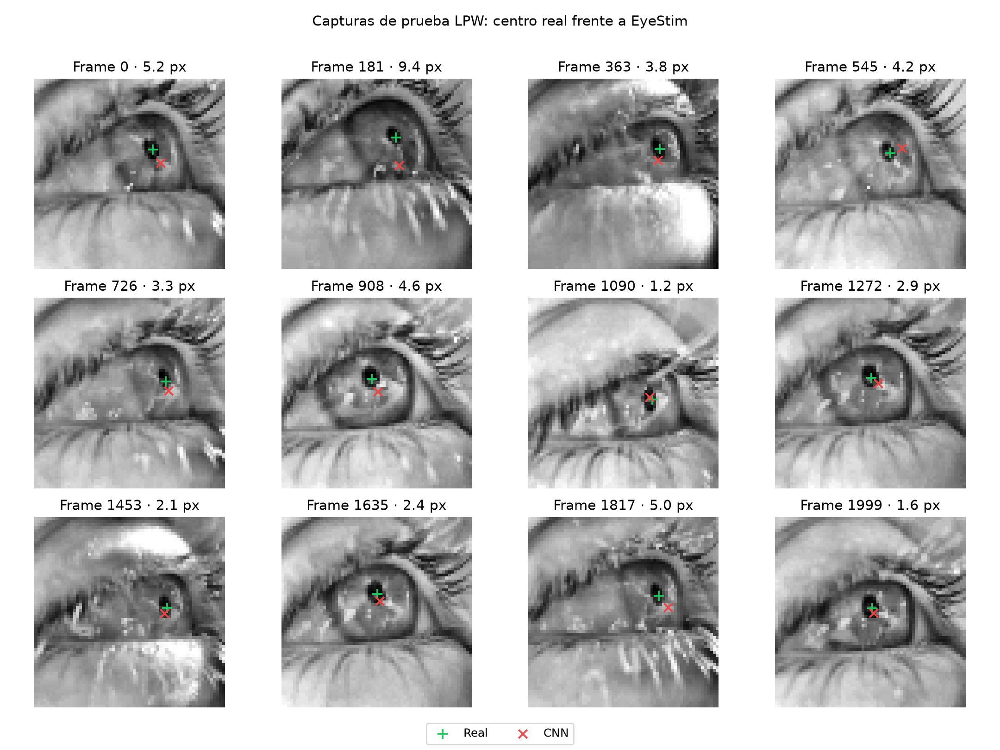
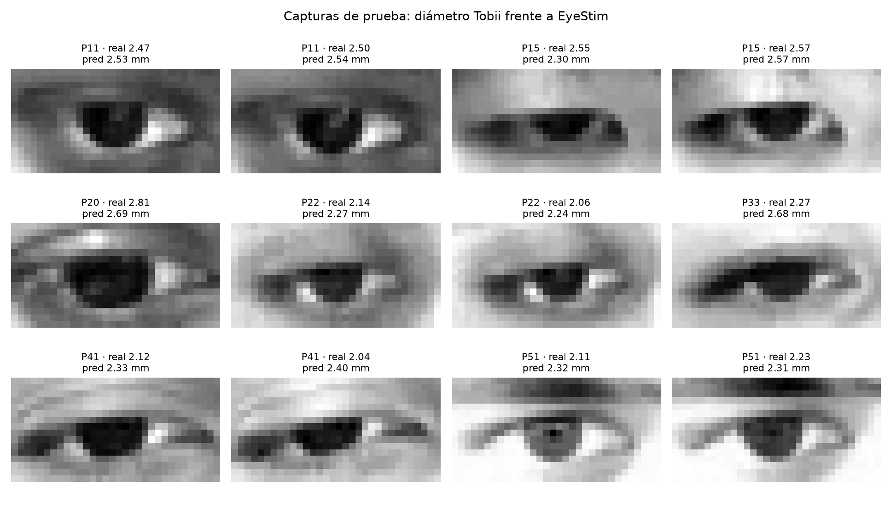

# Informe final de investigación y validación de EyeStim

**Fecha del informe:** 2026-09-09  
**Ejecución de entrenamiento y pruebas:** 2026-09-06  
**Rama evaluada:** `003-pupilometry-attention`  
**Resultado general:** prototipo funcional de medición pupilar; todavía no es un instrumento clínico ni un medidor comprobado de atención.

## Resumen

Se sustituyó BioID como fuente de entrenamiento porque sólo contiene posiciones aproximadas de los ojos y no incluye centros o elipses de pupila, diámetro, punto de mirada ni condiciones de atención. La versión final usa un conjunto de datos distinto para cada medida:

- **LPW** entrena el centro pupilar con anotaciones reales y separación por participante.
- **EyeDentify** entrena el diámetro pupilar en milímetros desde recortes webcam sincronizados con una referencia Tobii.
- **Cambridge/Świrski** prueba de manera independiente el proceso completo: centro CNN → recorte → umbral → elipse.
- **BBBD/NEMAR** permite comprobar si el índice distingue entre una condición atenta y una distraída; no entrena el detector visual.

El cambio de datos resolvió el problema del modelo BioID, que casi siempre predecía el mismo punto. En un participante LPW reservado, el error medio de centro bajó de **10.374 px a 4.445 px**, una reducción de **57.15%**. El modelo EyeDentify obtuvo **0.202 mm de MAE** en 1,280 imágenes de siete participantes no usados durante el entrenamiento, frente a **0.224 mm** de una solución que siempre responde con la media. En una prueba con 150 imágenes Cambridge reservadas, el proceso completo detectó el 100%, con **0.876 px de MAE de diámetro** y correlación de Spearman de **0.785**.

La mejora del diámetro frente a la solución sencilla ocurrió en 6 de 7 participantes, pero la prueba de Wilcoxon dio `p=0.296875`. Por tanto, el resultado es prometedor, aunque todavía no permite asegurar una mejora general. Además, la fórmula 0–100 de EyeStim fue mayor en la condición distraída del conjunto BBBD/NEMAR. La interfaz y los reportes ahora la llaman **índice ocular experimental**, no porcentaje de atención.



### Muestras de las imágenes y predicciones

Los identificadores son anónimos. Las imágenes LPW muestran el centro correcto con una cruz verde y la predicción de EyeStim con una cruz roja. Las imágenes EyeDentify muestran participantes distintos y comparan el diámetro Tobii con la salida del modelo.





## 1. Preguntas de investigación realmente comprobables

El proyecto original mezclaba tres objetivos que exigen referencias diferentes:

1. localizar el centro de la pupila en una imagen ocular;
2. medir el diámetro de la pupila;
3. estimar la atención a partir de señales que cambian con el tiempo.

Los dos primeros tienen medidas correctas con las cuales se pueden comparar. La atención no se observa de forma directa y también cambia por la iluminación, el esfuerzo, la sorpresa, la fatiga, la distancia a la cámara, el parpadeo y la tarea. Por eso, encontrar la pupila no basta para afirmar que una persona está atenta.

La pregunta que sí puede responder esta versión es: **¿puede EyeStim estimar el centro y el diámetro pupilar con una webcam mediante modelos ligeros y procesamiento local?** Las pruebas indican que sí, con los errores y límites descritos aquí. Para la pregunta **¿mide atención?**, las pruebas indican que la fórmula actual no es válida.

## 2. Datos usados y forma de comprobarlos

### 2.1 EyeDentify: diámetro webcam con referencia Tobii

Se incorporó una parte del [conjunto oficial EyeDentify](https://www.kaggle.com/datasets/vijuls/pupildiameterdatasets), descrito también en su [repositorio oficial](https://github.com/vijulshah/eyedentify). El archivo original ocupa cerca de 34 GB. El programa de descarga lee su lista interna y obtiene sólo los archivos necesarios. También comprueba el tamaño y el código CRC para detectar errores, sin descargar todo el archivo.

La parte descargada conserva los 51 participantes y todas las sesiones de iluminación disponibles. Se tomaron hasta cuatro imágenes (`15, 35, 55, 75`) por sesión de tres segundos:

| Grupo | Participantes | Imágenes | Media esperada | Desv. esperada |
|---|---:|---:|---:|---:|
| Entrenamiento | 36 | 6,734 | 2.384 mm | 0.298 mm |
| Validación | 8 | 1,411 | 2.426 mm | 0.314 mm |
| Prueba | 7 | 1,280 | 2.365 mm | 0.259 mm |
| **Total** | **51** | **9,425** | — | — |

La separación se realizó con `seed=42`. Los participantes se ordenaron por diámetro promedio, se formaron cuatro grupos y cada persona quedó sólo en entrenamiento, validación o prueba. Después se volvieron a leer las 9,425 imágenes y se encontró lo siguiente:

- 0 imágenes faltantes o ilegibles;
- 0 rutas duplicadas;
- 0 valores no numéricos o fuera del intervalo de control de 1–9 mm;
- forma uniforme `16×32×3`;
- 0 participantes compartidos entre entrenamiento, validación y prueba.

Licencia declarada: **CC BY-NC 4.0**. Los datos permanecen en `data/external/eyedentify/`, fuera de Git. La lista exacta usada se guardó como `docs/training/dataset_manifest_snapshot.csv`.

### 2.2 LPW: localización del centro pupilar

Se descargó desde la [fuente oficial LPW](https://darus.uni-stuttgart.de/dataset.xhtml?persistentId=doi%3A10.18419%2Fdarus-3237) un vídeo completo de cada uno de ocho participantes, con 2,000 imágenes anotadas por persona: 16,000 imágenes en total. La separación también se hizo por participante:

| Split | Participantes | Frames |
|---|---|---:|
| Entrenamiento | 1–6 | 12,000 |
| Validación | 7 | 2,000 |
| Prueba | 8 | 2,000 |

Cada vídeo y etiqueta se comparó con el código MD5 publicado. Se generaron archivos comprimidos `64×64` para acelerar el trabajo y permitir que el proceso se repita. Licencia: **CC BY-NC-SA 4.0**. LPW usa imágenes infrarrojas y no imágenes RGB de webcam. Sus posiciones son correctas, pero sus imágenes son diferentes a las de la cámara final.

### 2.3 Cambridge/Świrski: prueba independiente de elipse

El conjunto [Cambridge pupil tracking](https://www.cl.cam.ac.uk/research/rainbow/projects/pupiltracking/datasets/) proporciona elipses marcadas de forma manual. El participante 1 se usó para probar varios tamaños de recorte y valores de umbral; el participante 2 se reservó para la prueba final. No se utilizó para entrenar ninguna CNN.

### 2.4 BBBD/NEMAR: condición cognitiva

El conjunto [NEMAR nm000150](https://www.nemar.org/dataset/nm000150) contiene grabaciones en condiciones atenta y distraída, además de mediciones EyeLink. Se usaron 24 participantes con ambas sesiones para comprobar el comportamiento de la fórmula, no para evaluar la webcam. Los detalles del análisis y de los cambios aplicados a los datos están en `dataset_validation_report.md` y en el cuaderno 03.

## 3. Modelos y forma de entrenamiento

### 3.1 CNN de centro

`EyePupilCNN` recibe un recorte gris del ojo de `64×64`, mejora su contraste con CLAHE y entrega las coordenadas `(x,y)` normalizadas. Se entrenó con Smooth L1, AdamW, cambios de brillo y contraste, imágenes volteadas y pequeños movimientos. El mejor modelo se eligió sólo con el participante LPW 7; el participante 8 quedó reservado para la prueba final.

- mejor época: 12;
- parada temprana: época 22;
- tiempo total CPU: 392.43 s;
- uso aislado del modelo: 1.681 ms por ojo;
- modelo activo: `src/models/eyestim_cnn.pth`;
- archivo para continuar el entrenamiento: `src/models/eyestim_center_checkpoint.pth`;
- copia del modelo anterior: `src/models/eyestim_cnn_bioid_legacy.pth`.

Código SHA-256 del modelo activo: `d509717eb822162a1d2ec2faf7b99a0830e899d458a7ac7c9925388447a787ad`.

### 3.2 CNN de diámetro

`PupilDiameterCNN` recibe una imagen a color BGR de `64×32`, tiene 177,953 parámetros y estima el diámetro normalizado con la media y desviación del grupo de entrenamiento. Se usó L1, AdamW, ajustes para evitar sobreentrenamiento y cambios de brillo, contraste, desenfoque, ruido e imágenes volteadas. El mejor modelo se eligió únicamente con los ocho participantes de validación.

- mejor época: 9;
- parada temprana: época 23;
- tiempo total CPU: 175.70 s;
- uso aislado del modelo: 0.640 ms por ojo;
- modelos periódicos guardados: épocas 10 y 20;
- mejor modelo activo: `src/models/eyestim_diameter.pth`;
- último estado: `src/models/eyestim_diameter_last.pth`.

Código SHA-256 del mejor modelo: `739fa1e609a2de590a15706de7d27b22ad1c548ad07fbc0073df053c06985b47`.

### 3.3 Pupilometría clásica

La CNN de centro marca un recorte local de `32×32`. Después se suaviza la imagen, se aplica el umbral `mínimo+35`, se cierran pequeños espacios y se ajusta una elipse. El valor anterior del umbral era 15. El valor 35 se eligió con el participante Cambridge 1 y se comprobó una sola vez con el participante 2, sin ajustar el método con los resultados de la prueba.

## 4. Resultados producidos

### 4.1 Centro pupilar: antes y después de usar datos correctos

Prueba sobre 2,000 imágenes del participante LPW 8:

| Métrica | BioID legado | LPW nuevo | Cambio |
|---|---:|---:|---:|
| Error medio | 10.374 px | **4.445 px** | -57.15% |
| Mediana | 10.560 px | **4.244 px** | -59.81% |
| P95 | 16.257 px | **8.824 px** | -45.72% |
| Dentro de 3 px | 3.70% | **31.30%** | +27.60 pp |
| Dentro de 5 px | 7.80% | **62.65%** | +54.85 pp |

El modelo BioID producía casi el mismo punto para todas las imágenes (`desviación≈0`), lo que indica que no aprendió la posición. El nuevo modelo sí cambia su respuesta (`desviación x=0.188`, `desviación y=0.088`) y mejora todas las medidas, aunque un error de 4.445 px todavía requiere calibración y pruebas con más cámaras.

### 4.2 Diámetro EyeDentify

Prueba sobre 1,280 imágenes y siete participantes no usados en el entrenamiento:

| Medida | CNN EyeDentify | Responder con la media |
|---|---:|---:|
| MAE | **0.202 mm** | 0.224 mm |
| Mediana AE | **0.185 mm** | 0.210 mm |
| RMSE | **0.244 mm** | 0.260 mm |
| P95 AE | **0.455 mm** | 0.457 mm |
| Dentro de ±0.25 mm | **67.27%** | 60.08% |
| Dentro de ±0.50 mm | **96.88%** | 96.41% |
| R² | **0.116** | -0.005 |
| Pearson / Spearman | 0.550 / 0.600 | no aplicable |
| Sesgo | +0.107 mm | +0.019 mm |

La mejora del MAE es 9.58%. El sesgo positivo y las diferencias entre participantes muestran que la CNN todavía puede relacionar parte de la respuesta con cada persona o condición. Se necesitan más imágenes, cámaras y calibración por dispositivo. El modelo fue mejor en 6 de 7 participantes, pero `p=0.296875`: siete personas no son suficientes para asegurar una mejora general.

Se conservaron dos experimentos de desarrollo con 20 participantes. Sin aumento, el MAE fue 0.238 mm y R² -0.258; con aumento, 0.184 mm y R² 0.175. Como esos ensayos usan otros sujetos de prueba, sirven para justificar el aumento fotométrico, no para comparar directamente su cifra con el modelo final de 51 participantes.

### 4.3 Prueba completa con otras imágenes

Prueba en Cambridge participante 2, 150 imágenes, sin proporcionar al algoritmo el centro anotado:

| Métrica | Resultado |
|---|---:|
| Tasa de detección | **100%** |
| Error del centro CNN | 5.708 px |
| Error del centro después de elipse | **1.764 px** |
| MAE de diámetro | **0.876 px** |
| Mediana AE | 0.726 px |
| P95 AE | 2.131 px |
| Sesgo de diámetro | -0.681 px |
| Spearman del diámetro | **0.785** |

El ajuste local de la elipse corrige parte del error del centro CNN. El sesgo negativo indica que el diámetro suele estimarse por debajo del valor real. En una prueba adicional, oscurecer la imagen 40 niveles elevó el MAE a 6.992 px; la iluminación sigue siendo el principal riesgo técnico.

### 4.4 Prueba del índice ocular

En 24 sujetos pareados BBBD/NEMAR:

| Condición | Índice EyeStim medio |
|---|---:|
| Atenta | 80.734 |
| Distraída | **86.616** |

La diferencia atenta−distraída fue -5.882 (`p=0.000430`) y sólo 5 de 24 participantes mostraron la dirección esperada. Esto indica que el valor actual no puede presentarse como porcentaje de atención. Un clasificador de prueba, separado por participante, obtuvo AUC 0.696 y exactitud balanceada de 0.641. Las señales contienen algo de información, pero necesitan un modelo nuevo, etiquetas de desempeño y control de iluminación.

## 5. Revisión de criterios de éxito originales

| Criterio | Estado | Evidencia y límite |
|---|---|---|
| SC-001: varianza instrumental <0.8 px en reposo e iluminación constante | **No demostrado** | La prueba mide el error en imágenes fijas (MAE 0.876 px), no la repetición de medidas durante una sesión controlada. MAE y varianza no son lo mismo. |
| SC-002: sistema completo ≥15 FPS en CPU | **Parcial** | Centro y diámetro por separado tardan 1.681 y 0.640 ms/ojo. Falta medir juntos la captura, la detección facial, OpenCV, la interfaz y los dos ojos. |
| SC-003: atención reacciona <1 s | **No válido científicamente** | La fórmula se actualiza en cada imagen, pero entrega el resultado contrario al esperado en BBBD/NEMAR. Que sea rápida no significa que mida atención. |
| SC-004: reporte y gráficas <2 s | **Cumplido** | Reporte de una sesión simulada de 600 imágenes generado en aproximadamente 0.5 s; ambos archivos fueron comprobados en disco. |

## 6. Cambios visibles para el usuario

- El modelo LPW reemplaza al modelo BioID en el visor.
- El modelo EyeDentify agrega `Pupila CNN: … mm*` a la información mostrada en pantalla.
- El asterisco declara que la salida es experimental y no clínica.
- La barra se titula `Índice ocular*`, no atención cognitiva.
- La tecla `t` abre `project_dashboard.png`, un panel con los datos, la mejora frente al modelo anterior, la comparación del diámetro y la prueba completa.
- Al salir, el reporte registra tanto píxeles como milímetros cuando el modelo EyeDentify está presente.

## 7. Archivos que permiten repetir las pruebas

Los archivos principales son:

- `output/pdf/eyestim_paper_academico_2026.pdf`: informe académico final de Servicio Social;
- `notebooks/04_final_training_and_validation.ipynb`: cuaderno ejecutado con resultados y panel incluido;
- `docs/training/final_validation_summary.json`: medidas guardadas en formato JSON;
- `docs/training/end_to_end_predictions.csv`: las 150 predicciones independientes;
- `docs/training/center_history.csv` y `history.csv`: historia completa por época;
- `docs/training/center_learning_curve.png` y `diameter_learning_curve.png`: curvas de entrenamiento/validación;
- `docs/training/center_sample_predictions.png` y `sample_test_predictions.png`: capturas con predicción frente a referencia;
- `docs/training/training_dashboard.png`: panel del entrenamiento de diámetro;
- `docs/training/project_dashboard.png`: panel final que muestra la aplicación;
- `docs/training/session_example/`: salida comprobada del reportero.

Reproducción desde PowerShell, en la raíz del repositorio:

```powershell
.\.venv\Scripts\python.exe -m pip install -r requirements-research.txt
.\.venv\Scripts\python.exe scripts\download_validation_data.py eyedentify lpw-center swirski nemar --eyedentify-participants 1-51 --frames-per-session 4
.\.venv\Scripts\python.exe src\train_center.py
.\.venv\Scripts\python.exe src\train_diameter.py --augment
.\.venv\Scripts\python.exe research\final_validation.py
.\.venv\Scripts\python.exe -m jupyter nbconvert --to notebook --execute --inplace --ExecutePreprocessor.timeout=300 notebooks\04_final_training_and_validation.ipynb
```

La descarga completa puede requerir tiempo y ancho de banda. El programa vuelve a usar los archivos válidos y verifica las fuentes. Los modelos y conjuntos de datos no se suben a Git por su tamaño y licencia, pero permanecen instalados localmente.

## 8. Limitaciones y siguientes pruebas necesarias

1. Repetir EyeDentify usando más imágenes de cada sesión y calcular márgenes de error por participante.
2. Recolectar una prueba local con la webcam final, regla física o eye tracker, iluminación medida y distancia fija; medir repetibilidad, no sólo MAE.
3. Evaluar el centro y diámetro bajo diferentes niveles de iluminación, gafas, colores de iris, tonos de piel, obstáculos, movimiento y cámaras.
4. Sustituir Haar por un detector más confiable o medir claramente sus fallos.
5. Medir los cuadros por segundo de todo el sistema durante una sesión real en el CPU objetivo.
6. Diseñar de nuevo el índice de atención con tareas equilibradas, preguntas de desempeño, preguntas breves sobre distracción e iluminación registrada. Cada participante de prueba debe quedar fuera del entrenamiento.
7. No convertir el índice a “porcentaje” hasta comprobar que distingue condiciones, puede calibrarse y funciona con participantes nuevos.

## Conclusión

La investigación ahora usa datos adecuados para **centro** y **diámetro** y conserva los archivos necesarios para repetir desde la descarga hasta la prueba final. El resultado más claro es la mejora del centro pupilar. El error de diámetro también bajó frente a una respuesta constante en 6 de 7 participantes, aunque la diferencia es menor. La prueba Cambridge confirma que el proceso completo funciona con imágenes diferentes a las de entrenamiento, aunque todavía presenta error constante y sensibilidad a la iluminación.

El proyecto puede presentarse honestamente como **prototipo de pupilometría experimental en tiempo real**. No debe presentarse todavía como medición clínica, medición exacta en milímetros para cualquier cámara, seguimiento calibrado de mirada en pantalla ni cuantificación de atención cognitiva.
