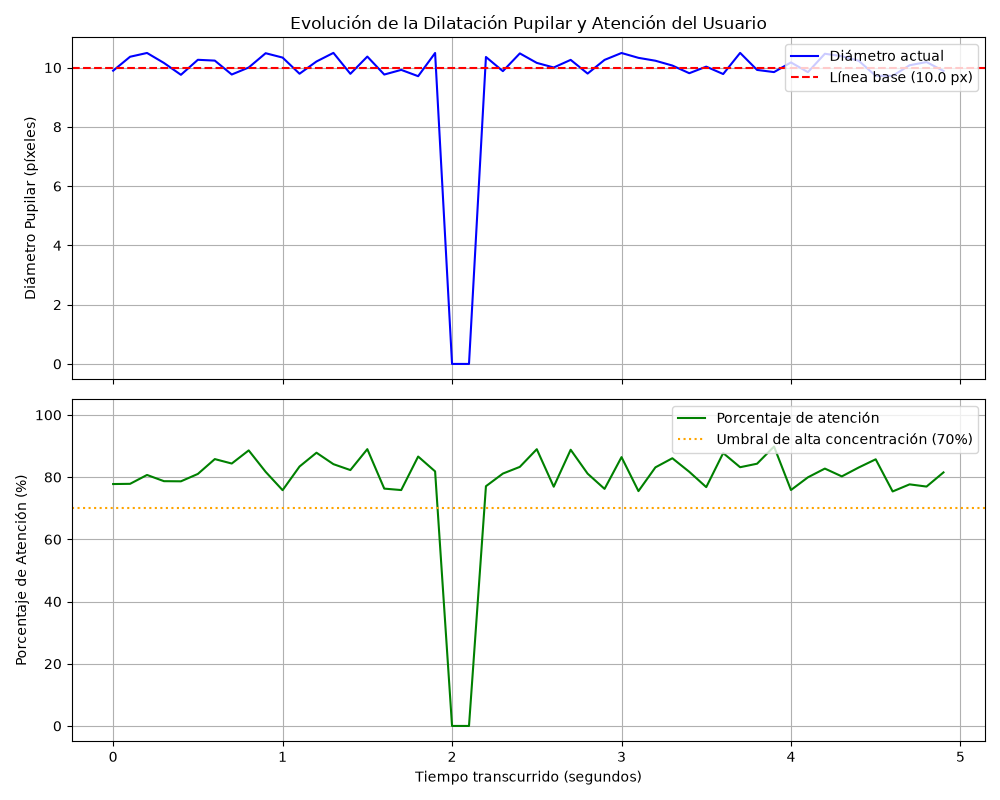

# Reporte Analítico de Atención y Pupilometría
**Fecha de Análisis**: 2026-07-01 15:13:26
**Duración de la Sesión**: 4.90 segundos
**Muestras totales (Fotogramas)**: 50

## Resumen Ejecutivo

- **Porcentaje de Atención Promedio**: 78.51%
- **Diámetro Pupilar Promedio**: 10.11 píxeles
- **Línea Base del Sujeto**: 10.00 píxeles (calibrada)

---

## Distribución de Atención por Zonas

La siguiente tabla detalla la cantidad de fotogramas y el porcentaje de tiempo que el usuario permaneció enfocado en cada región de la pantalla:

| Zona de Enfoque | Fotogramas (Muestras) | Porcentaje de Permanencia |
| :--- | :---: | :---: |
| **Centro** | 35 | 70.00% |
| **Arriba** | 0 | 0.00% |
| **Abajo** | 0 | 0.00% |
| **Izquierda** | 0 | 0.00% |
| **Derecha** | 15 | 30.00% |

---

## Gráficos de Evolución Temporal

La evolución en tiempo real de las variables cognitivas y fisiológicas registradas durante la sesión se detalla a continuación:

---

## Notas de Interpretación Fisiológica

1. **Dilatación Cognitiva**: Variaciones positivas en el diámetro de la pupila por encima de la línea base calibrada (10.0 px), sin cambios en la iluminación ambiental, indican un incremento de la carga cognitiva o atención concentrada del sujeto.
2. **Estabilidad de la Mirada**: Una varianza baja en la zona de enfoque se correlaciona con periodos de lectura fija o atención sostenida, empujando al alza el porcentaje de atención calculado.
3. **Parpadeos**: Los valles de caída a 0% de atención representan parpadeos o oclusiones momentáneas del rostro del usuario, lo cual es normal y saludable durante la visualización prolongada.
