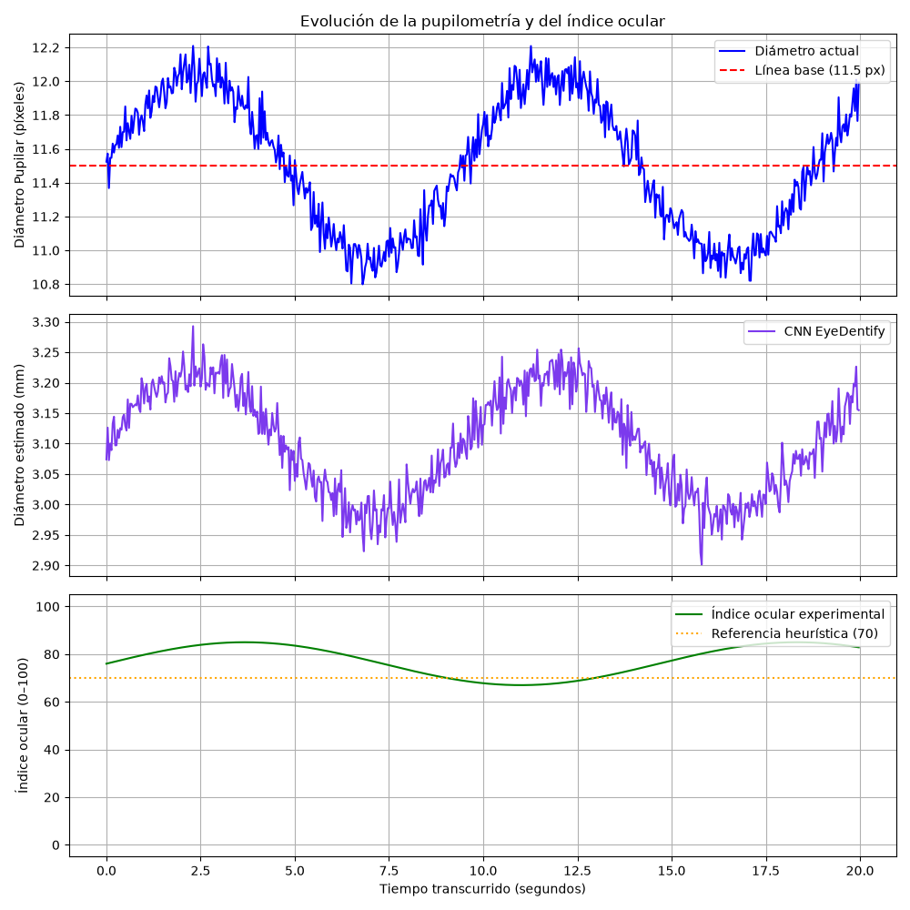

# Reporte Analítico Experimental de Pupilometría
**Fecha de Análisis**: 2026-09-09 19:02:07
**Duración de la Sesión**: 19.97 segundos
**Muestras totales (Fotogramas)**: 600

## Resumen Ejecutivo

- **Índice Ocular Experimental Promedio**: 77.73/100
- **Diámetro Pupilar Promedio**: 11.51 píxeles
- **Diámetro CNN EyeDentify Promedio**: 3.10 mm
- **Línea Base del Sujeto**: 11.50 píxeles (calibrada)

---

## Distribución de Mirada Heurística por Zonas

La siguiente tabla detalla la cantidad de fotogramas y el porcentaje de tiempo que el usuario permaneció enfocado en cada región de la pantalla:

| Zona de Enfoque | Fotogramas (Muestras) | Porcentaje de Permanencia |
| :--- | :---: | :---: |
| **Centro** | 540 | 90.00% |
| **Arriba** | 0 | 0.00% |
| **Abajo** | 0 | 0.00% |
| **Izquierda** | 0 | 0.00% |
| **Derecha** | 60 | 10.00% |

---

## Gráficos de Evolución Temporal

La evolución temporal de las variables oculares registradas durante la sesión se detalla a continuación:

---

## Límites de interpretación

1. El valor 0–100 es un **índice heurístico de estabilidad ocular**, no una probabilidad ni una medición clínica/cognitiva de atención.
2. El diámetro CNN en milímetros se entrenó con EyeDentify y referencia Tobii, pero requiere calibración local antes de usarse como medición física del dispositivo actual.
3. Luminancia, distancia a cámara, postura, iris, gafas, fatiga y activación autonómica pueden modificar las señales.
4. Los ceros representan ausencia de una detección válida y pueden incluir parpadeos u oclusiones.
